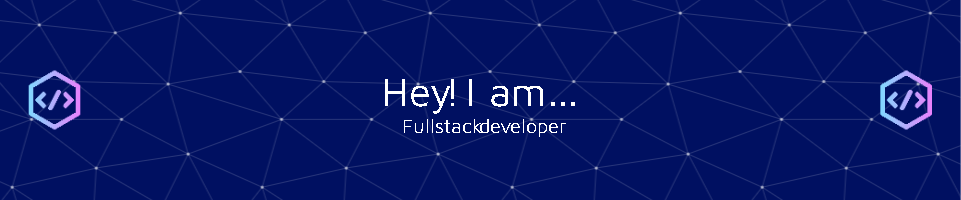
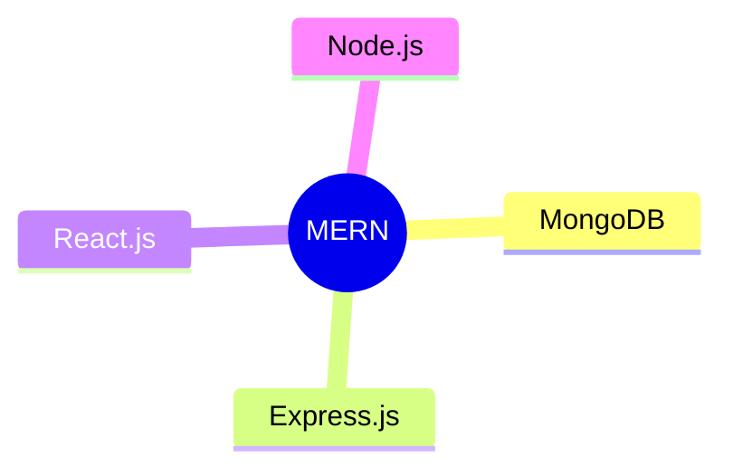

# OM GAWANDE

  
  
  
  
  
  
  
  
  

    
  

---

##  About Me

Results-driven **Full-Stack Developer** specializing in **MERN stack** technologies with proven success improving web performance by **20%** and user engagement by **40%**. I combine strong technical expertise in React.js, Node.js, and database management with AI integration skills to deliver responsive, user-centric applications that achieve business objectives while maintaining optimal performance.

  

---

## 💼 Professional Experience

### Frontend Developer
**GamerzRealm Pvt. Ltd.** | January 2025 - Present

- 🚀 Designed and developed responsive interfaces using **React.js** for GamerzRealm.in
- 🎨 Implemented cyberpunk-inspired UI/UX design, increasing average session duration by **25%**
- 🧪 Conducted user testing and iterated on UI enhancements for improved functionality
- 📈 Collaborated with SEO teams to implement best practices for better organic visibility

### Full Stack Developer
**Borgward Technology Pvt Ltd** | January 2024 – June 2024

- 🏗️ Architected web applications using **MongoDB, Express.js, React.js, and Node.js**
- ⚡ Optimized frontend performance by **20%** through code splitting and lazy loading
- 🎭 Developed an interactive portfolio with advanced CSS animations, enhancing user retention by **40%**
- 🔄 Engineered RESTful API endpoints resulting in **15%** increased user engagement

---

## 🚀 Projects

  <table>
    <tr>
      <td>
        <h3>Chat-GPT Enhanced Version</h3>
        
<strong>MERN Stack, Gemini AI API</strong>

        
Engineering a generative AI chat bot with enhanced capabilities and 98% accuracy target using Google's Gemini-AI API

        
        
        
      </td>
      <td>
        <h3>Personal Portfolio</h3>
        
<strong>React.js, JSON, HTML, CSS, JS</strong>

        
Dynamic portfolio website with animated components that increased click-through rate by 20%

        
        
        
      </td>
    </tr>
    <tr>
      <td>
        <h3>AI-Resume Analyzer</h3>
        
<strong>Python, Streamlit, NLP, MySQL</strong>

        
Interactive web application that extracts resume data with 95% accuracy using NLP algorithms

        
        
        
      </td>
      <td>
        <h3>Student Result Management</h3>
        
<strong>Java (Android), Firebase, XML</strong>

        
Mobile app with 85% reduced latency through Firebase integration, serving students, teachers and admins

        
        
        
      </td>
    </tr>
  </table>

---

## 🛠️ Technical Skills

  
### Core Technologies

### Languages & Frameworks
  

  
  
  
  
  
  
  
  
  
  
  

### UI/UX & Design

  
  
  
  

### Other Technologies

  
  
  
  
  
  

---

## 🎓 Education

  
  
<strong>Sinhgad Institute of Management and Computer Application</strong> | Pune, Maharashtra, India

  
CGPA: 8.5 | Graduated: June 2024

  
<em>Courses: Data Structures, Operating System, Java, Python, KR/AI, ML, OOPS, Networking</em>

---

  
  
  

  

